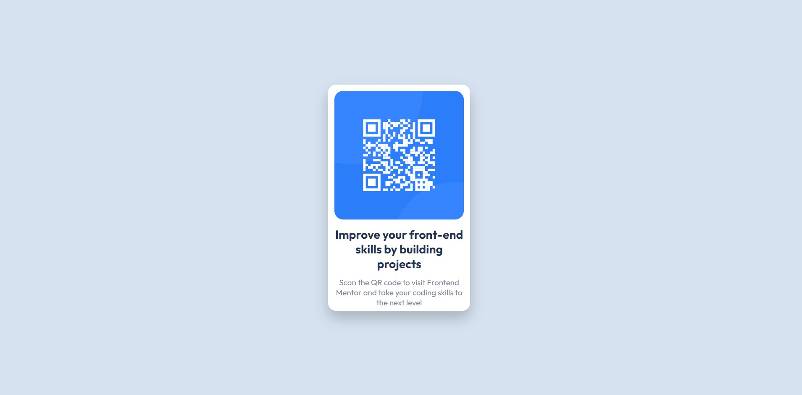

# Frontend Mentor - QR code component solution

This is a solution to the [QR code component challenge on Frontend Mentor](https://www.frontendmentor.io/challenges/qr-code-component-iux_sIO_H). Frontend Mentor challenges help you improve your coding skills by building realistic projects. 

## Table of contents

- [Overview](#overview)
  - [Screenshot](#screenshot)
  - [Links](#links)
- [My process](#my-process)
  - [Built with](#built-with)
  - [What I learned](#what-i-learned)
  - [Continued development](#continued-development)
  - [Useful resources](#useful-resources)
- [Author](#author)
- [Acknowledgments](#acknowledgments)

**Note: Delete this note and update the table of contents based on what sections you keep.**

## Overview

### Screenshot

### Links

- Solution URL: [Add solution URL here](https://your-solution-url.com)
- Live Site URL: [Add live site URL here](https://your-live-site-url.com)

## My process

### Built with

- Semantic HTML5 markup
- CSS custom properties
- Flexbox

### What I learned

After going through the HTML and CSS sections of Colt Steele's Web Developer 2022 Bootcamp I thought I'd be able to do this QR code challenge. And well, I was disappointed to find out how little I actually knew. After starting I quickly realised I'd need to do a step back and revisit some of the CSS sections from the Bootcamp. After this break I thought I knew what I'd had to change to find the solution. Once again, I was disapppointed to find out that one problem solved created a couple more things to fix.
But this time I managed to google my problems and knew a couple more things to try. 

Did I want to give up every five minutes. Yes. Is this solution perfect? No. I'm certain it's very flawed and not even entirely finished. But it did teach me to keep going and to google my problems along the way. 

So I'm considering this a good start, but there's still plenty to learn.

### Continued development

I didn't struggle with getting the HTML down as much as I did with the CSS part of this challenge. But I'll continue working on both.

## Author

- Website - [Add your name here](https://www.your-site.com)
- Frontend Mentor - [@yourusername](https://www.frontendmentor.io/profile/yourusername)
- Twitter - [@yourusername](https://www.twitter.com/yourusername)

